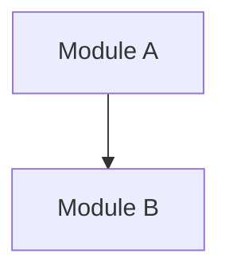
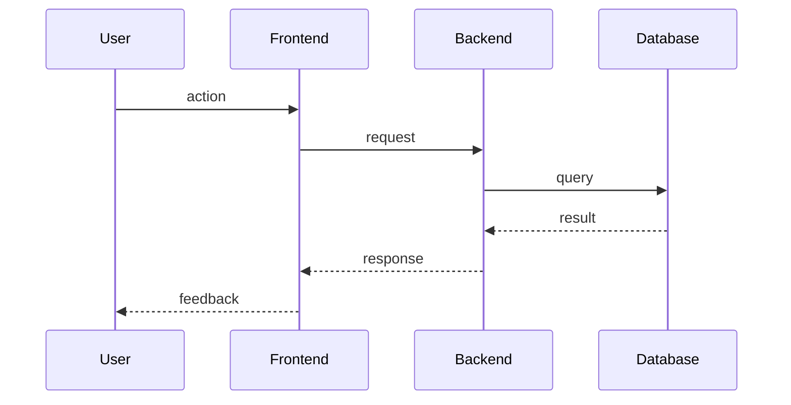

# Project Setup

This skill runs once, at the start of a new project. It populates the base docs through a guided conversation before any other work begins.

**Hard gate: do not invoke any other skill or take any implementation action until this skill completes.**

---

## Process

Ask questions **one at a time**. Wait for the answer before asking the next. Prefer multiple-choice when possible.

### 1. Configure CLAUDE.md

Ask for the project references and update `CLAUDE.md`:
- What is the GitHub org/username?
- What is the project name? (used to build repo names: `org/project-docs`, `org/project-backend`, `org/project-frontend`)
- Which package manager do you use? (pnpm, npm, yarn, bun) — defaults to pnpm

Update the `CLAUDE.md` Configuration section with the values provided.

---

### 2. Fill `docs/product.md`

Cover these topics, one question at a time:
- What does this project do? (one sentence)
- Who are the users? (roles, personas)
- What is the main problem it solves?
- What are the key features planned for the first version?
- Are there any known constraints or non-goals?

---

### 3. Fill `docs/architecture.md`

Cover these topics, one question at a time:
- What are the main domains/modules of the system? (e.g. users, orders, inventory)
- How do these modules relate to each other? Which ones communicate?
- Are there any external services or integrations? (email, payment, storage, etc.)
- What is the database structure at a high level? (main entities)

After collecting answers, generate a Mermaid diagram and write it to `docs/architecture.md`:



---

### 4. Fill `docs/flows.md`

Cover these topics, one question at a time:
- What is the most important user flow? (step by step: user does X → system does Y → result is Z)
- Are there other key flows? (authentication, main CRUD operations, critical business flows)

Write each flow as a numbered narrative and a Mermaid sequence diagram:



---

### 5. Initialize `docs/glossary.md`

Ask:
- Are there domain-specific terms that need definition? (business terms, abbreviations, Portuguese terms that map to English code names)

Write each term as:
```
**Term** — definition. Code: `EnglishName`
```

---

### 6. Initialize `docs/reminders.md`

Create `docs/reminders.md` with the health-check counter initialized at 0 if it doesn't already exist. Use the template structure from the boilerplate (health check section, maintenance section, gotchas section).

---

## Recovery

If the conversation is interrupted or the user returns to a partially completed setup:

1. Check which docs already have content: `docs/product.md`, `docs/architecture.md`, `docs/flows.md`, `docs/glossary.md`, `docs/reminders.md`
2. Skip steps that are already populated — do not re-ask questions for filled docs
3. Resume from the first incomplete step
4. If a doc is partially filled, present its current content to the user and ask: "This was partially filled. Do you want to continue from here or start this section over?"

---

## Completion

When all docs are filled:

1. Present a summary of what was created
2. Ask the user to confirm everything is correct
3. If confirmed → inform the user the project is ready and the normal workflow can begin
4. If corrections needed → adjust and confirm again

**Do not proceed to the normal Entry Point until the user explicitly confirms the setup is complete.** After confirmation, the setup skill is complete. If the user has a pending request, proceed to Entry Point Step 1 (Load context) to handle it. If not, ask: "Setup is complete. What would you like to build first?"
