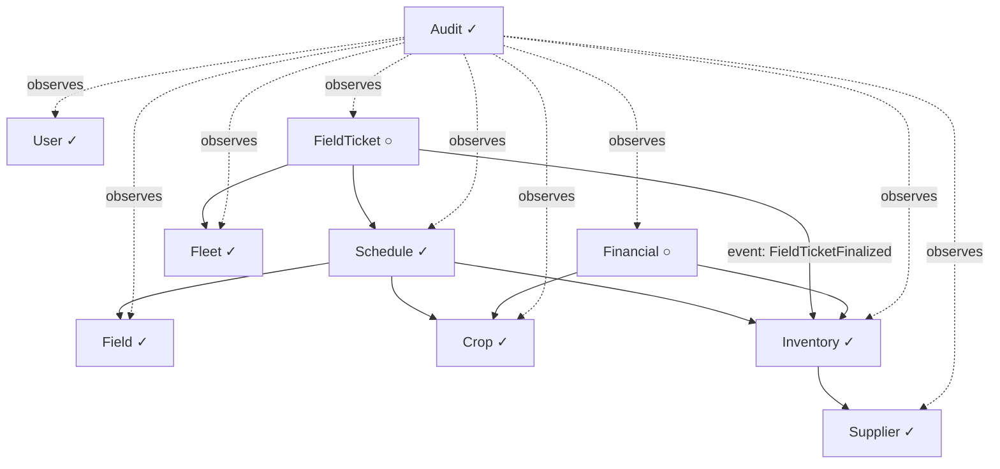

# Architecture

## System overview

Monolithic NestJS backend with a Next.js frontend, connected via REST API. The system is organized into bounded contexts following DDD principles. Each domain has its own entities, use cases, and repository interfaces. Cross-domain communication happens via domain events. Single-tenant for MVP, architected to not block future multi-tenant migration.

---

## Domains

| Domain | Responsibility | Status |
|--------|---------------|--------|
| **User** | Authentication, authorization, role-based access, user management | Implemented |
| **Field** | Field (talhao) registry — area, location, status | Implemented |
| **Crop** | Crop types, varieties, harvest lifecycle (unscheduled → active → complete/cancel) | Implemented |
| **Audit** | Full audit trail of every user action (cross-cutting, event-driven) | Implemented |
| **Schedule** | Per-field operation planning — operations (spraying, fertigation), inputs with dosage per 100L, timeline. Drives Harvest activation. | Implemented |
| **FieldTicket** | Generated from schedule. Review → print → execute → finalize workflow | Planned |
| **Inventory** | Categories, inputs (insumos), purchases (entradas), stock movements (saídas), stock balance | Implemented |
| **Supplier** | Supplier registry for tracking input purchase origins | Implemented |
| **Fleet** | Vehicle and implement registry for tractors and agricultural implements | Implemented |
| **Financial** | Revenue, expenses, cost per crop/field | Post-MVP |

---

## Module relationships

**Legend:** ✓ = implemented, ○ = planned

**Notes:**
- User is cross-cutting — every non-public endpoint requires authentication and authorization
- Audit subscribes to domain events from all domains — never called directly
- Schedule drives Harvest lifecycle: ScheduleActivatedEvent → Harvest becomes ACTIVE, ScheduleCancelledEvent → Harvest reverts to UNSCHEDULED
- Solid arrows represent data dependencies resolved at runtime via QueryBus (see `coding-patterns/backend/query-bus.md`). Use cases never import repositories from other domains — they use typed query contracts instead
- Relationships for planned domains are preliminary and will be refined during implementation

---

## External integrations

None in MVP. Infrastructure decisions deferred to post-MVP.

---

## Cross-cutting concerns

| Concern | Approach |
|---------|----------|
| **Authentication** | JWT (access token 6 min + refresh token 7 days) with token rotation. CSRF protection via double-submit cookie. Proxy handles preventive refresh on navigation. HTTP client handles reactive refresh on 401. All endpoints private by default. `@Public()` decorator for exceptions. |
| **Authorization** | CASL ability factory per role (owner, manager, family). Checked via guard + decorator. |
| **Validation** | Zod schemas in `ZodValidationPipe` (backend) and `zodResolver` (frontend forms). |
| **Error handling** | `Either<Error, Result>` in use cases. Domain error filters map to HTTP status codes. |
| **Caching** | Redis for frequently accessed read-only data. Cache invalidation via domain events. |
| **Logging** | Winston with structured JSON. Domain layer never logs. Controllers log error/warn. Event subscribers log error/info. |
| **Audit** | Every mutation emits a domain event consumed by the Audit subscriber. Stores actor, action, entity, timestamp, before/after snapshot. |
| **Cross-domain queries** | QueryBus — static in-process request/reply bus (see `coding-patterns/backend/query-bus.md`). Use cases query other domains via typed query contracts instead of importing their repositories. Subscribers are exempt — they bridge domains directly. Designed to swap to a message broker for microservice migration. |
| **Pagination** | Mandatory on all listing endpoints. |
| **Multi-tenancy** | Not implemented in MVP. No design decisions that block future migration (avoid hardcoded single-tenant assumptions). |

---

## Infrastructure

| Component | Technology | Notes |
|-----------|-----------|-------|
| **Database** | PostgreSQL | Single instance, managed via Prisma |
| **Cache** | Redis | Query cache |
| **CI/CD** | TBD | |
| **Hosting** | TBD | |

---

## Constraints

- All API responses in English — frontend handles i18n (Portuguese UI)
- Single database — no microservices or separate DBs per domain
- No offline support in MVP — planned for future
- Currency: BRL only
- No external service integrations in MVP

---

## Decision Log

### 2026-03-17 — QueryBus for cross-domain data queries

**Context:** Health-check detected 18 module boundary violations: use cases importing repositories and error classes from other domains. As the system moves toward microservices, each domain must be independently deployable. Direct repository imports create tight coupling that blocks extraction.
**Decision:** Introduce a QueryBus — a static in-process request/reply bus in `src/core/query-bus/`. Query contracts (pure data types) live in the responding domain's `application/queries/`. Handlers self-register at NestJS startup via `QueryBusModule` (`@Global`). Use cases call `QueryBus.execute()` instead of injecting cross-domain repositories. Error classes that reference other domains are duplicated locally.
**Options considered:** (A) QueryBus in core with typed contracts (chosen) / (B) Shared service layer between domains / (C) Event sourcing with projections
**Rationale:** Option A mirrors the existing DomainEvents pattern (static class, self-registering handlers), requires zero database changes, and maps directly to a message broker for microservice migration. Option B creates a new coupling layer. Option C is overengineered for MVP.
**Consequences:** 21 use cases refactored (11 group A + 10 audit logs). 5 query contracts, 5 handlers, 3 local error classes created. HTTP modules no longer import cross-domain database modules (QueryBusModule is global). Subscribers remain exempt — they are the intended cross-domain bridge. New coding pattern documented at `docs/coding-patterns/backend/query-bus.md`.

### 2026-03-10 — Subdomain folders for multi-entity domains

**Context:** The Crop domain has 3 entities (CropType, Variety, Harvest) with 200+ files across frontend and backend. Maintaining all files in a single flat folder became unwieldy.
**Decision:** Multi-entity domains use subdomain folders within the domain folder. Each subdomain mirrors the standard domain structure (enterprise/application for backend, actions/api/components/schemas/store for frontend). Infrastructure layers (controllers, mappers, repositories, events modules) stay flat.
**Options considered:** (A) Subdomain folders within the domain (chosen) / (B) Separate top-level domains per entity
**Rationale:** Option A preserves the bounded context — CropType, Variety, and Harvest share business rules and reference each other. Option B would lose this semantic grouping and make cross-entity relationships implicit. Infrastructure stays flat because NestJS modules are the unit of composition and splitting them per entity adds unnecessary fragmentation.
**Consequences:** Import paths change from `@/domain/crop/enterprise/entities/crop-type` to `@/domain/crop/crop-types/enterprise/entities/crop-type`. All coding pattern docs updated with subdomain notes. See `coding-patterns/frontend/domain-organization.md` and `coding-patterns/backend/domain-organization.md`.

### 2026-03-16 — Harvest status PLANNED replaced with UNSCHEDULED

**Context:** The Schedule domain drives the Harvest lifecycle. A Harvest without a Schedule should reflect that state explicitly.
**Decision:** Replace Harvest status `PLANNED` with `UNSCHEDULED`. Harvest activation is no longer manual — it's triggered by ScheduleActivatedEvent. When a Schedule is cancelled, Harvest reverts to UNSCHEDULED.
**Options considered:** (A) Add UNSCHEDULED alongside PLANNED / (B) Replace PLANNED with UNSCHEDULED (chosen)
**Rationale:** Having both PLANNED and UNSCHEDULED creates ambiguity. UNSCHEDULED clearly communicates "no schedule exists yet". The Schedule domain has its own PLANNED status for "schedule exists but not yet active".
**Consequences:** Manual ActivateHarvest endpoint removed. Harvest activation only via Schedule domain events. All existing PLANNED data migrated to UNSCHEDULED.

### 2026-03-17 — Copy schedule wizard with preview endpoint and conflict resolution

**Context:** The original copy schedule feature only supported copying to UNSCHEDULED harvests with offset date mode. Users needed more control: choice of date mode (offset vs absolute), ability to copy to harvests with existing schedules (add or replace), inline harvest creation, and a preview step before executing.
**Decision:** Implement a 4-step wizard (target → config → preview → confirm) with a new GET preview endpoint that returns the copy mapping without executing. The POST endpoint now accepts `dateMode` (offset/absolute) and `conflictResolution` (add/replace) parameters with backward-compatible defaults.
**Options considered:** (A) Enhance existing dialog with more fields / (B) Multi-step wizard with preview (chosen)
**Rationale:** The preview step prevents user mistakes (operations out of range, unintended replacements). The wizard provides progressive disclosure — users only see conflict resolution when it's relevant. The preview endpoint is read-only, avoiding accidental mutations.
**Consequences:** New `softDeleteByScheduleId` method added to operations repository. `CopyScheduleUseCase` no longer requires UNSCHEDULED status — accepts any harvest. Old `CopyScheduleDialog` and `CopyScheduleForm` deprecated in favor of `CopyScheduleWizard`. Store renamed `copyScheduleDialogOpen` → `copyScheduleWizardOpen`. New shadcn/ui components added: Tabs, RadioGroup, Badge, Alert.

### 2026-03-09 — Single-tenant MVP with multi-tenant awareness

**Context:** The app will be a SaaS, but MVP targets a single farm for testing.
**Decision:** Build single-tenant for MVP, but avoid architecture that blocks multi-tenant migration.
**Options considered:** Single-tenant aware (chosen) / Full multi-tenant from day one / Single-tenant with no future consideration
**Rationale:** Reduces MVP complexity while keeping the door open. Avoiding things like global singletons, hardcoded tenant assumptions, or shared mutable state.
**Consequences:** Entity design should not assume a single tenant. When multi-tenant is added, a `tenantId` can be introduced without major refactoring.
