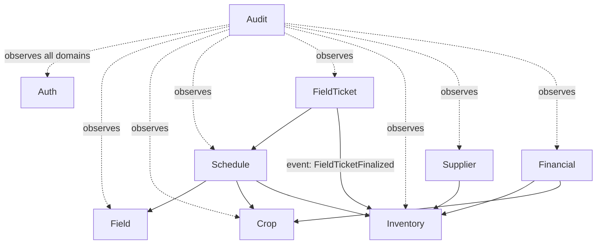

# Architecture

## System overview

Monolithic NestJS backend with a Next.js frontend, connected via REST API. The system is organized into bounded contexts following DDD principles. Each domain has its own entities, use cases, and repository interfaces. Cross-domain communication happens via domain events. Single-tenant for MVP, architected to not block future multi-tenant migration.

---

## Domains

| Domain | Responsibility |
|--------|---------------|
| **Auth** | Authentication, authorization, role-based access, user management |
| **Field** | Field (talhao) registry — area, location, status |
| **Crop** | Crop cycles, varieties, planting/harvest periods |
| **Schedule** | Per-field operation planning — operations, inputs, timeline |
| **FieldTicket** | Generated from schedule. Review → print → execute → finalize workflow |
| **Inventory** | Inputs, seeds, harvested products, stock control |
| **Supplier** | Supplier registry, input purchase tracking |
| **Financial** | Revenue, expenses, cost per crop/field |
| **Audit** | Full audit trail of every user action |

---

## Module relationships

**Notes:**
- Auth is cross-cutting — every non-public endpoint requires authentication and authorization
- Audit subscribes to events from all domains — never called directly
- Relationships are preliminary and will be refined as each domain is implemented

---

## External integrations

None in MVP. Infrastructure decisions deferred to post-MVP.

---

## Cross-cutting concerns

| Concern | Approach |
|---------|----------|
| **Authentication** | JWT (access token 6 min + refresh token 7 days) with token rotation. CSRF protection via double-submit cookie. Proxy handles preventive refresh on navigation. HTTP client handles reactive refresh on 401. All endpoints private by default. `@Public()` decorator for exceptions. |
| **Authorization** | CASL ability factory per role (owner, manager, family). Checked via guard + decorator. |
| **Validation** | Zod schemas in `ZodValidationPipe` (backend) and `zodResolver` (frontend forms). |
| **Error handling** | `Either<Error, Result>` in use cases. Domain error filters map to HTTP status codes. |
| **Caching** | Redis for frequently accessed read-only data. Cache invalidation via domain events. |
| **Logging** | Winston with structured JSON. Domain layer never logs. Controllers log error/warn. Event subscribers log error/info. |
| **Audit** | Every mutation emits a domain event consumed by the Audit subscriber. Stores actor, action, entity, timestamp, before/after snapshot. |
| **Pagination** | Mandatory on all listing endpoints. |
| **Multi-tenancy** | Not implemented in MVP. No design decisions that block future migration (avoid hardcoded single-tenant assumptions). |

---

## Infrastructure

| Component | Technology | Notes |
|-----------|-----------|-------|
| **Database** | PostgreSQL | Single instance, managed via Prisma |
| **Cache** | Redis | Query cache |
| **CI/CD** | TBD | |
| **Hosting** | TBD | |

---

## Constraints

- All API responses in English — frontend handles i18n (Portuguese UI)
- Single database — no microservices or separate DBs per domain
- No offline support in MVP — planned for future
- Currency: BRL only
- No external service integrations in MVP

---

## Decision Log

### 2026-03-10 — Subdomain folders for multi-entity domains

**Context:** The Crop domain has 3 entities (CropType, Variety, Harvest) with 200+ files across frontend and backend. Maintaining all files in a single flat folder became unwieldy.
**Decision:** Multi-entity domains use subdomain folders within the domain folder. Each subdomain mirrors the standard domain structure (enterprise/application for backend, actions/api/components/schemas/store for frontend). Infrastructure layers (controllers, mappers, repositories, events modules) stay flat.
**Options considered:** (A) Subdomain folders within the domain (chosen) / (B) Separate top-level domains per entity
**Rationale:** Option A preserves the bounded context — CropType, Variety, and Harvest share business rules and reference each other. Option B would lose this semantic grouping and make cross-entity relationships implicit. Infrastructure stays flat because NestJS modules are the unit of composition and splitting them per entity adds unnecessary fragmentation.
**Consequences:** Import paths change from `@/domain/crop/enterprise/entities/crop-type` to `@/domain/crop/crop-types/enterprise/entities/crop-type`. All coding pattern docs updated with subdomain notes. See `coding-patterns/frontend/domain-organization.md` and `coding-patterns/backend/domain-organization.md`.

### 2026-03-09 — Single-tenant MVP with multi-tenant awareness

**Context:** The app will be a SaaS, but MVP targets a single farm for testing.
**Decision:** Build single-tenant for MVP, but avoid architecture that blocks multi-tenant migration.
**Options considered:** Single-tenant aware (chosen) / Full multi-tenant from day one / Single-tenant with no future consideration
**Rationale:** Reduces MVP complexity while keeping the door open. Avoiding things like global singletons, hardcoded tenant assumptions, or shared mutable state.
**Consequences:** Entity design should not assume a single tenant. When multi-tenant is added, a `tenantId` can be introduced without major refactoring.
