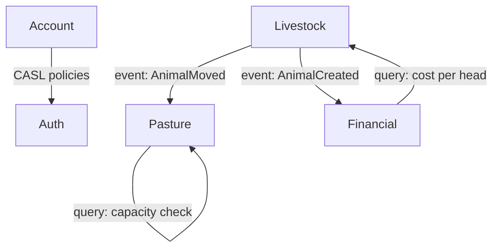

# Architecture

High-level view of the system: domains, how they relate, external integrations, and cross-cutting concerns. This is the structural map Claude reads before implementing any feature or adding a new domain.

**Why this matters:** Without architecture context, Claude doesn't know which modules exist, how they communicate, or what constraints apply. With it, Claude places new code in the right module, respects boundaries, and avoids breaking existing relationships.

---

## How to fill this document

If using `/project-setup`, Claude will guide you through these questions interactively.
If using `/architecture-discussion`, Claude will update the relevant sections and add a Decision Log entry.

For manual editing, fill each section below. Keep descriptions short — 1-2 sentences per item. The Mermaid diagram is the primary reference for module relationships.

---

## How Claude uses this document

- **During Phase 0 (Refinement):** Understand which domains exist and how they relate before planning a feature.
- **During Phase 1 (Planning):** Place new code in the correct module and respect domain boundaries.
- **During `/new-domain`:** Verify the new domain fits the existing architecture and update the diagram.
- **During `/health-check`:** Check for architectural drift (layer violations, boundary crossings).

---

## System overview

_One paragraph describing the system at a high level — what it is, how it's structured, and what the main technical boundaries are._

<!-- Example: A monolithic NestJS backend with a Next.js frontend, connected via REST API. The system is organized into bounded contexts following DDD principles. Each domain has its own entities, use cases, and repository interfaces. Cross-domain communication happens via domain events. -->

---

## Domains

_List each domain/module with a one-line description of its responsibility._

<!-- Example:
| Domain | Responsibility |
|--------|---------------|
| **Auth** | User authentication, JWT tokens, password recovery |
| **Account** | User profiles, roles, permissions (CASL) |
| **Livestock** | Animal registry, breed management, weight tracking |
| **Pasture** | Paddock management, rotation schedules, grazing capacity |
| **Financial** | Revenue, expenses, cost per animal, profitability reports |
-->

---

## Module relationships

_Mermaid diagram showing how domains relate. Arrows indicate dependency direction (who depends on whom). Label arrows with the communication mechanism._

<!-- Example:

-->

**Rules for this diagram:**
- Arrows show data/event flow, not import direction
- Label arrows: `event: EventName`, `query: description`, or `sync: description`
- Domains without arrows are standalone — they only depend on Auth for access control
- Update this diagram in Phase 4 whenever a new domain or relationship is added

---

## External integrations

_List any external services the system integrates with, how, and which domain owns the integration._

<!-- Example:
| Service | Purpose | Protocol | Owner domain |
|---------|---------|----------|-------------|
| **AWS S3** | File storage (animal photos, documents) | SDK | Shared (infra) |
| **SendGrid** | Transactional emails (password recovery, reports) | REST API | Notification |
| **Stripe** | Payment processing (subscriptions) | Webhook + REST | Financial |
-->

_If no external integrations exist yet, write "None" and update when integrations are added._

---

## Cross-cutting concerns

_Architectural decisions that apply across all domains._

<!-- Example:
| Concern | Approach |
|---------|----------|
| **Authentication** | JWT (access + refresh tokens). All endpoints private by default. `@Public()` decorator for exceptions. |
| **Authorization** | CASL ability factory per role. Checked via `CaslAbilityGuard` + `@CheckPolicies()`. |
| **Validation** | Zod schemas in `ZodValidationPipe` (backend) and `zodResolver` (frontend forms). |
| **Error handling** | `Either<Error, Result>` in use cases. Domain error filters map to HTTP status codes. Frontend: `handleHttpError` + `renderToast`. |
| **Caching** | Redis for frequently accessed read-only data. Cache invalidation via domain events. |
| **Logging** | Winston with structured JSON. Log levels: error (failures), warn (recoverable), info (business events). |
| **Multi-tenancy** | Not applicable / Row-level isolation via `tenantId` on all entities / Schema-per-tenant. |
| **Pagination** | Offset-based (UI with page numbers) or cursor-based (infinite scroll). Never return unbounded lists. |
-->

---

## Infrastructure

_High-level infrastructure setup. Not deployment details — just what exists and where._

<!-- Example:
| Component | Technology | Notes |
|-----------|-----------|-------|
| **Database** | PostgreSQL 16 | Single instance, managed via Prisma |
| **Cache** | Redis 7 | Session store + query cache |
| **File storage** | AWS S3 | Presigned URLs for upload/download |
| **CI/CD** | GitHub Actions | Lint → Test → Build → Deploy |
| **Hosting** | AWS ECS (backend), Vercel (frontend) | Auto-scaling enabled |
-->

_If infrastructure is not yet defined, write "TBD" and update when decisions are made._

---

## Constraints

_Technical constraints that affect architectural decisions._

<!-- Example:
- All API responses in English — frontend handles i18n
- No WebSocket support in v1 — polling for real-time features
- Single database — no microservices or separate DBs per domain
- Must support concurrent users on the same farm (optimistic locking)
-->

---

## Decision Log

_Architectural decisions are recorded here. Each entry is added by `/architecture-discussion` or during implementation when a significant decision is made._

_Format:_

```markdown
### YYYY-MM-DD — Title

**Context:** what problem prompted this decision
**Decision:** what was decided
**Options considered:** Option A (chosen) / Option B / Option C
**Rationale:** why Option A was chosen
**Consequences:** what changes as a result
```

<!-- Example:

### 2026-01-15 — Event-driven cross-domain communication

**Context:** Livestock domain needs to notify Financial when an animal is sold, but we want to avoid direct coupling.
**Decision:** Use domain events dispatched synchronously within the same transaction, consumed by subscribers in the reacting domain.
**Options considered:** Domain events (chosen) / Direct use case calls / Message queue (RabbitMQ)
**Rationale:** Domain events maintain bounded context isolation without infrastructure overhead. Message queues add complexity we don't need at this scale. Direct calls would create circular dependencies.
**Consequences:** Each domain defines its own events. Subscribers are fire-and-forget (log errors, never rethrow). Event contracts are typed and versioned.

-->
