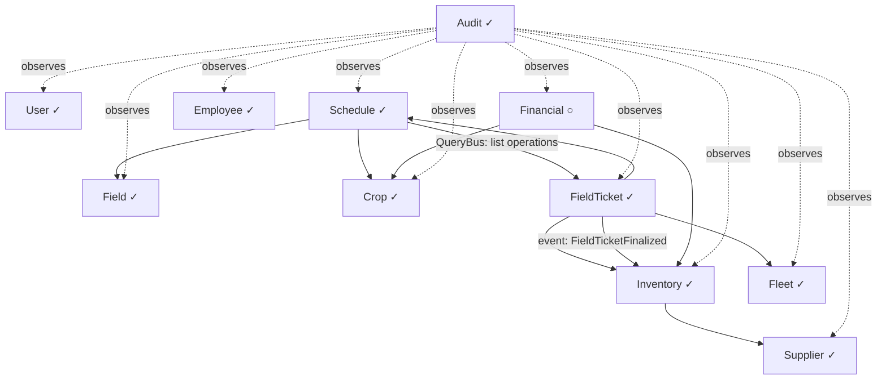

# Architecture

## System overview

Monolithic NestJS backend with a Next.js frontend, connected via REST API. The system is organized into bounded contexts following DDD principles. Each domain has its own entities, use cases, and repository interfaces. Cross-domain communication happens via domain events. Single-tenant for MVP, architected to not block future multi-tenant migration.

---

## Domains

| Domain | Responsibility | Status |
|--------|---------------|--------|
| **User** | Authentication, authorization, role-based access, user management | Implemented |
| **Field** | Field (talhao) registry — area, location, status | Implemented |
| **Crop** | Crop types, varieties, harvest lifecycle (planned → active → complete/cancel) | Implemented |
| **Audit** | Full audit trail of every user action (cross-cutting, event-driven) | Implemented |
| **Schedule** | Lightweight grouping entity per harvest/field. Status is automatic (PLANNED/ACTIVE/UNDER_REVIEW/COMPLETED/CANCELLED). Only 1 ACTIVE per field. Drives Harvest lifecycle. | Implemented |
| **FieldTicket** | The operation itself — born as DRAFT when added to a schedule. Review → print → execute → finalize workflow. Schedule lists its operations via FieldTickets. | Implemented |
| **Inventory** | Categories, inputs (insumos), purchases (entradas), stock movements (saídas), stock balance | Implemented |
| **Supplier** | Supplier registry for tracking input purchase origins | Implemented |
| **Fleet** | Vehicle and implement registry for tractors and agricultural implements | Implemented |
| **Employee** | Employee registry and organizational positions (cargos) | Implemented |
| **Financial** | Revenue, expenses, cost per crop/field | Post-MVP |

---

## Module relationships

**Legend:** ✓ = implemented, ○ = planned

**Notes:**
- User is cross-cutting — every non-public endpoint requires authentication and authorization
- Audit subscribes to domain events from all domains — never called directly
- Schedule drives Harvest lifecycle automatically: schedule ACTIVE → Harvest ACTIVE, schedule COMPLETED → Harvest COMPLETED, schedule CANCELLED → Harvest CANCELLED. Only 1 ACTIVE schedule per field at a time
- Schedule no longer owns operations directly — FieldTicket IS the operation. Schedule queries FieldTickets via QueryBus to list its operations. This is intentional: the ticket is what matters in the field, and future schedule-specific fields already exist in the FieldTicket table.
- Solid arrows represent data dependencies resolved at runtime via QueryBus (see `coding-patterns/backend/query-bus.md`). Use cases never import repositories from other domains — they use typed query contracts instead
- Relationships for planned domains are preliminary and will be refined during implementation

---

## Cross-cutting concerns

| Concern | Approach |
|---------|----------|
| **Authentication** | JWT (access token 6 min + refresh token 7 days) with token rotation. CSRF protection via double-submit cookie. Proxy handles preventive refresh on navigation. HTTP client handles reactive refresh on 401. All endpoints private by default. `@Public()` decorator for exceptions. |
| **Authorization** | CASL ability factory per role (owner, manager, family). Checked via guard + decorator. |
| **Validation** | Zod schemas in `ZodValidationPipe` (backend) and `zodResolver` (frontend forms). |
| **Error handling** | `Either<Error, Result>` in use cases. Domain error filters map to HTTP status codes. |
| **Caching** | Redis for frequently accessed read-only data. Cache invalidation via domain events. |
| **Logging** | Winston with structured JSON. Domain layer never logs. Controllers log error/warn. Event subscribers log error/info. |
| **Audit** | Every mutation emits a domain event consumed by the Audit subscriber. Stores actor, action, entity, timestamp, before/after snapshot. |
| **Cross-domain queries** | QueryBus — static in-process request/reply bus (see `coding-patterns/backend/query-bus.md`). Use cases query other domains via typed query contracts instead of importing their repositories. Subscribers are exempt — they bridge domains directly. Designed to swap to a message broker for microservice migration. |
| **Pagination** | Mandatory on all listing endpoints. |
| **Multi-tenancy** | Not implemented in MVP. No design decisions that block future migration (avoid hardcoded single-tenant assumptions). |

---

## Infrastructure

| Component | Technology | Notes |
|-----------|-----------|-------|
| **Database** | PostgreSQL | Single instance, managed via Prisma |
| **Cache** | Redis | Query cache |

---

## Constraints

- All API responses in English — frontend handles i18n (Portuguese UI)
- Single database — no microservices or separate DBs per domain
- No offline support in MVP — planned for future
- Currency: BRL only
- No external service integrations in MVP
