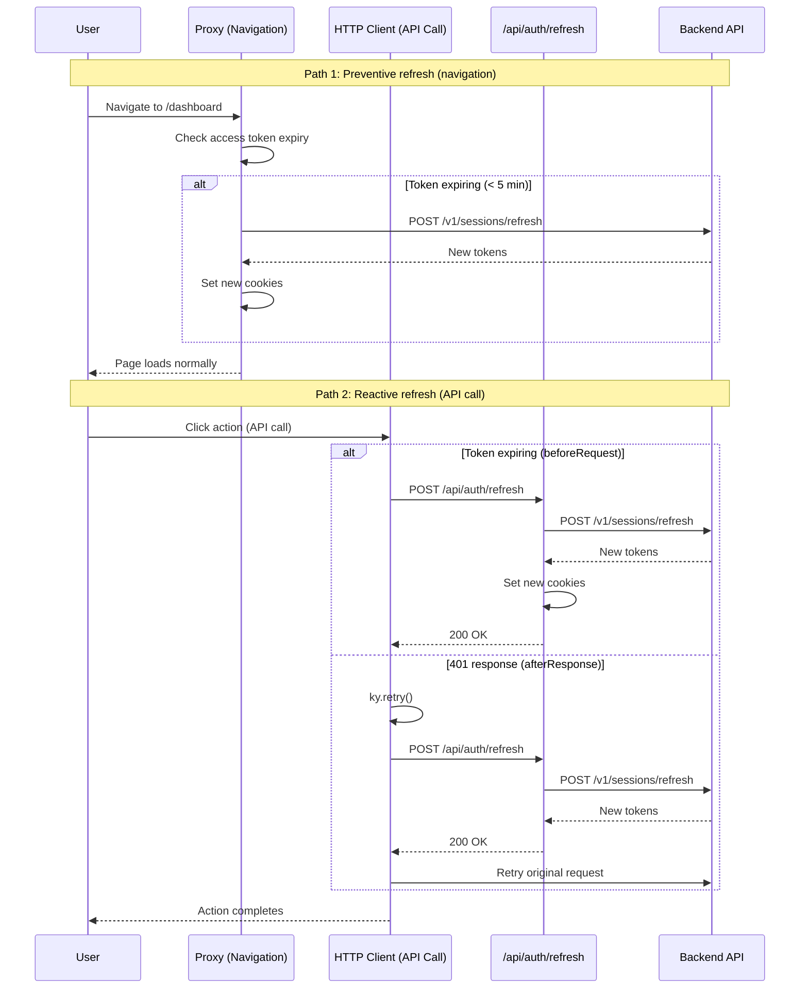
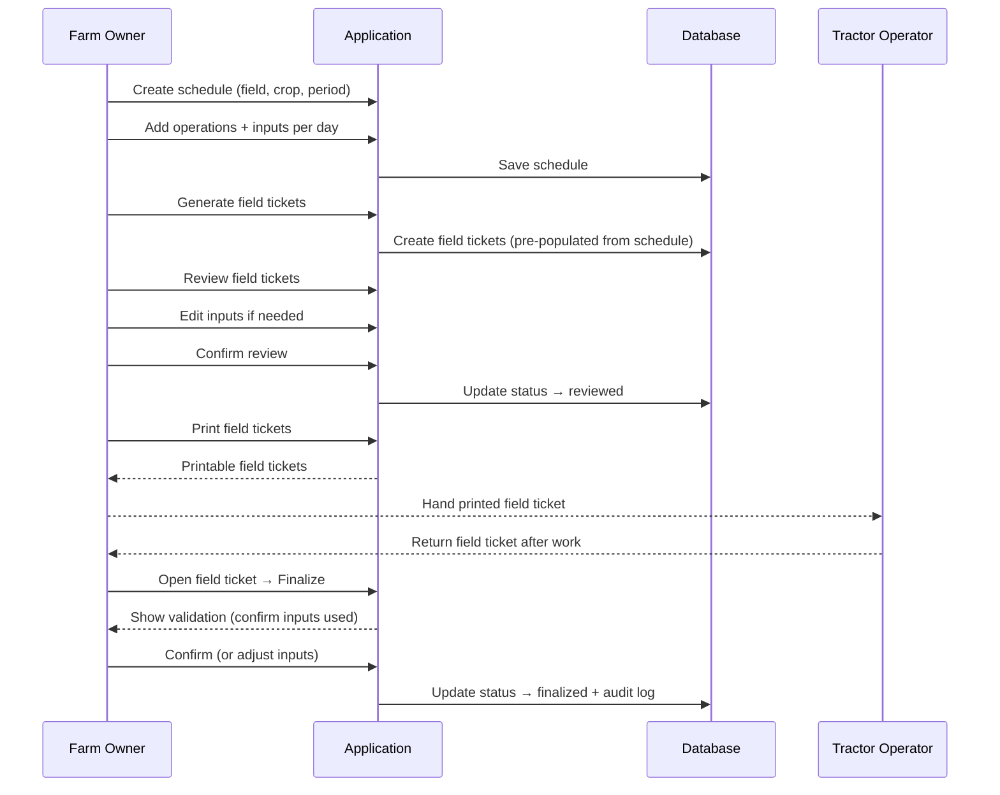

# Flows

## Auth

### Sign in [MVP]

**Trigger:** User navigates to the app without an active session
**Actor:** Any user
**Domain:** Auth

**Happy path:**
1. User opens the app → redirected to sign-in page
2. User fills email and password → clicks "Entrar"
3. System validates credentials → returns JWT tokens
4. User is redirected to dashboard

**Error cases:**
- Invalid credentials → inline error: "Email ou senha incorretos"
- Account locked → toast: "Conta bloqueada. Tente novamente mais tarde."

---

### Sign up [MVP]

**Trigger:** User clicks "Criar conta" on sign-in page
**Actor:** New user
**Domain:** Auth

**Happy path:**
1. User clicks "Criar conta" → sign-up form opens
2. User fills name, email, password → clicks "Cadastrar"
3. System creates account → returns JWT tokens
4. User is redirected to dashboard

**Error cases:**
- Email already exists → inline error: "Email já cadastrado"
- Weak password → inline validation

---

### Password recovery [MVP]

**Trigger:** User clicks "Esqueci minha senha" on sign-in page
**Actor:** Existing user
**Domain:** Auth

**Happy path:**
1. User clicks "Esqueci minha senha" → recovery form opens
2. User fills email → clicks "Enviar"
3. System sends recovery link
4. User clicks link → sets new password → redirected to sign-in

**Error cases:**
- Email not found → same success message (security: don't reveal if account exists)

---

### Token refresh [MVP]

**Trigger:** Access token is expired or expiring within 5 minutes
**Actor:** Authenticated user (automatic, transparent)
**Domain:** Auth

**Two refresh points:**

**1. Proxy (preventive — on navigation):**
1. User navigates to any private route
2. Proxy reads access token cookie → decodes JWT → checks if `exp` is within 5 minutes (`REFRESH_THRESHOLD_SECONDS`)
3. If expiring → proxy calls backend `POST /v1/sessions/refresh` with refresh token + CSRF token
4. Backend validates refresh token, revokes old one, generates new access + refresh + CSRF tokens (token rotation)
5. Proxy sets new cookies on the response → user continues without interruption

**2. HTTP client (reactive — on API call):**
1. User performs an action that triggers an API call (e.g., submit form, load data)
2. `beforeRequest` hook checks if access token is expiring → if so, calls `/api/auth/refresh` (client-side only)
3. If token already expired and backend returns 401 → `afterResponse` triggers `ky.retry()` → `beforeRetry` calls `/api/auth/refresh`
4. API route calls backend `POST /v1/sessions/refresh` → updates cookies → retries original request

**Error cases:**
- Refresh token expired (7+ days inactive) → redirect to `/sign-in`
- Refresh token revoked (used twice — replay attack) → redirect to `/sign-in`
- CSRF token missing/invalid → refresh fails → redirect to `/sign-in`

---

## Field

### Create field [MVP]

**Trigger:** User clicks "Novo talhão" on the fields list page
**Actor:** Farm owner, Farm manager
**Domain:** Field

**Happy path:**
1. User clicks "Novo talhão" → form opens
2. User fills: name, area (hectares), location/description → submits
3. System creates field → success toast → list refreshes

**Error cases:**
- Duplicate name → inline error: "Talhão já cadastrado com esse nome"
- Missing required fields → inline validation

---

## Crop

### Create crop [MVP]

**Trigger:** User clicks "Nova safra" on the crops list page
**Actor:** Farm owner, Farm manager
**Domain:** Crop

**Happy path:**
1. User clicks "Nova safra" → form opens
2. User fills: crop type, variety, planting date, expected harvest date → submits
3. System creates crop → success toast → list refreshes

**Error cases:**
- Missing required fields → inline validation

---

## Inventory

### Register inventory item [MVP]

**Trigger:** User clicks "Novo item" on the inventory list page
**Actor:** Farm owner, Farm manager
**Domain:** Inventory

**Happy path:**
1. User clicks "Novo item" → form opens
2. User fills: name, type (input/seed/product), unit, quantity → submits
3. System creates inventory item → success toast → list refreshes

**Error cases:**
- Duplicate name → inline error: "Item já cadastrado"
- Missing required fields → inline validation

---

## Schedule

### Create schedule [MVP]

**Trigger:** User clicks "Novo cronograma" on the schedules page
**Actor:** Farm owner, Farm manager
**Domain:** Schedule

**Happy path:**
1. User clicks "Novo cronograma" → form opens
2. User selects: field, crop, variety, time period (start/end dates) → submits
3. System creates schedule → redirects to schedule detail page
4. User adds operations day by day:
   - Selects operation type (spraying, fertigation, etc.)
   - Selects day in the schedule
   - Assigns inputs from inventory (product, dosage)
5. User repeats step 4 until schedule is complete

**Error cases:**
- Field not found → select only shows existing fields
- Overlapping schedule for same field/period → error: "Já existe cronograma para este talhão neste período"
- Input not in inventory → select only shows existing inventory items

---

### Edit schedule [MVP]

**Trigger:** User opens an existing schedule and modifies operations/inputs
**Actor:** Farm owner, Farm manager
**Domain:** Schedule

**Happy path:**
1. User opens schedule detail page
2. User adds, removes, or edits operations and inputs
3. System saves changes → changes reflect in pending field tickets

**Error cases:**
- Schedule already has finalized field tickets for edited days → warning before proceeding

---

## FieldTicket

### Generate field tickets from schedule [MVP]

**Trigger:** User clicks "Gerar boletas" on a schedule
**Actor:** Farm owner, Farm manager
**Domain:** FieldTicket

**Happy path:**
1. User opens schedule → clicks "Gerar boletas"
2. System generates field tickets pre-populated with inputs per field per day (from schedule)
3. Field tickets appear in list with status "draft"

**Error cases:**
- Schedule has no operations → error: "Cronograma sem operações"
- Field tickets already generated for same period → warning: "Boletas já existentes serão substituídas?"

---

### Review field ticket [MVP]

**Trigger:** User opens a draft field ticket before printing
**Actor:** Farm owner, Farm manager
**Domain:** FieldTicket

**Happy path:**
1. User opens field ticket → sees pre-populated inputs (field, date, operations, products, dosages)
2. User reviews each item → can edit inputs if needed (change product, adjust dosage)
3. User confirms review → status changes to "reviewed"

**Error cases:**
- Input not available in inventory → warning

---

### Print field ticket [MVP]

**Trigger:** User clicks "Imprimir" on a reviewed field ticket
**Actor:** Farm owner, Farm manager
**Domain:** FieldTicket

**Happy path:**
1. User selects one or more reviewed field tickets → clicks "Imprimir"
2. System generates printable format → browser print dialog opens
3. Status changes to "printed"
4. Printed field ticket is handed to tractor operator

---

### Finalize field ticket [MVP]

**Trigger:** Tractor operator returns the field ticket after executing the work
**Actor:** Farm owner, Farm manager
**Domain:** FieldTicket

**Happy path:**
1. Tractor operator returns field ticket after completing work in the field
2. User opens the field ticket in the system → clicks "Finalizar"
3. System shows validation screen: user confirms each input was used correctly
4. If last-minute changes happened in the field → user edits the inputs to reflect what was actually used
5. User confirms → status changes to "finalized"
6. Audit log records the finalization with actual inputs used

**Error cases:**
- Inputs differ from original → system asks user to confirm changes
- Finalization can happen same day or next day — no time restriction

---

### Re-evaluate field ticket [MVP]

**Trigger:** User realizes a finalized field ticket was registered incorrectly
**Actor:** Farm owner, Farm manager
**Domain:** FieldTicket

**Happy path:**
1. User opens a finalized field ticket → clicks "Reavaliar"
2. Status changes back to allow editing
3. User corrects the inputs/information
4. User re-finalizes the field ticket
5. Audit log records the re-evaluation with reason and changes

**Error cases:**
- Only users with proper permissions can re-evaluate
