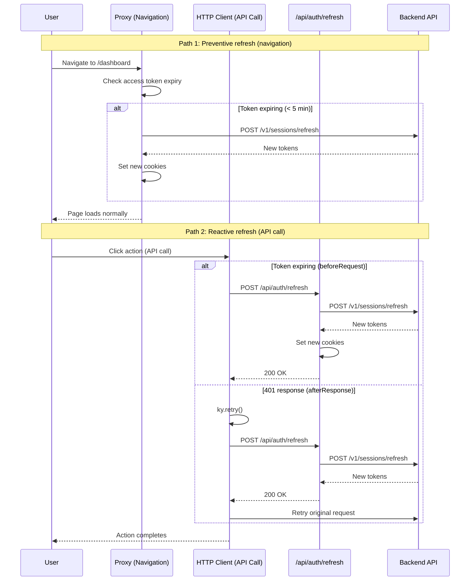
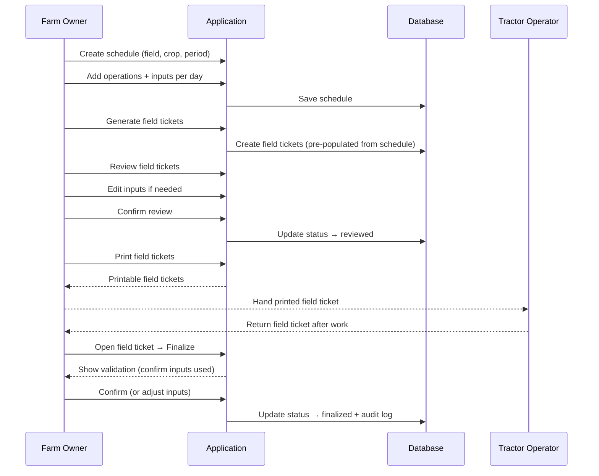

# Flows

## How to add a new flow

Each flow follows this format:

```markdown
### Flow name [MVP]

**Trigger:** What initiates the flow
**Actor:** Who performs the action
**Domain:** Which domain(s) are involved

**Happy path:**
1. Step-by-step description of the normal flow

**Error cases:**
- Error condition → expected behavior (toast, inline error, redirect)
```

**Guidelines:**
- Group flows by domain
- Include both happy path and error cases
- Error messages should be in Portuguese (frontend i18n responsibility)
- Use `[MVP]` tag for features in the minimum viable product
- Update this document in Phase 4 whenever user flows are added or changed

---

## Auth

### Sign in [MVP]

**Trigger:** User navigates to the app without an active session
**Actor:** Any user
**Domain:** Auth

**Happy path:**
1. User opens the app → redirected to sign-in page
2. User fills email and password → clicks "Entrar"
3. System validates credentials → returns JWT tokens
4. User is redirected to dashboard

**Error cases:**
- Invalid credentials → inline error: "Email ou senha incorretos"
- Account locked → toast: "Conta bloqueada. Tente novamente mais tarde."

---

### Sign up [MVP]

**Trigger:** User clicks "Criar conta" on sign-in page
**Actor:** New user
**Domain:** Auth

**Happy path:**
1. User clicks "Criar conta" → sign-up form opens
2. User fills name, email, password → clicks "Cadastrar"
3. System creates account → returns JWT tokens
4. User is redirected to dashboard

**Error cases:**
- Email already exists → inline error: "Email já cadastrado"
- Weak password → inline validation

---

### Password recovery [MVP]

**Trigger:** User clicks "Esqueci minha senha" on sign-in page
**Actor:** Existing user
**Domain:** Auth

**Happy path:**
1. User clicks "Esqueci minha senha" → recovery form opens
2. User fills email → clicks "Enviar"
3. System sends recovery link
4. User clicks link → sets new password → redirected to sign-in

**Error cases:**
- Email not found → same success message (security: don't reveal if account exists)

---

### Token refresh [MVP]

**Trigger:** Access token is expired or expiring within 5 minutes
**Actor:** Authenticated user (automatic, transparent)
**Domain:** Auth

**Two refresh points:**

**1. Proxy (preventive — on navigation):**
1. User navigates to any private route
2. Proxy reads access token cookie → decodes JWT → checks if `exp` is within 5 minutes (`REFRESH_THRESHOLD_SECONDS`)
3. If expiring → proxy calls backend `POST /v1/sessions/refresh` with refresh token + CSRF token
4. Backend validates refresh token, revokes old one, generates new access + refresh + CSRF tokens (token rotation)
5. Proxy sets new cookies on the response → user continues without interruption

**2. HTTP client (reactive — on API call):**
1. User performs an action that triggers an API call (e.g., submit form, load data)
2. `beforeRequest` hook checks if access token is expiring → if so, calls `/api/auth/refresh` (client-side only)
3. If token already expired and backend returns 401 → `afterResponse` triggers `ky.retry()` → `beforeRetry` calls `/api/auth/refresh`
4. API route calls backend `POST /v1/sessions/refresh` → updates cookies → retries original request

**Error cases:**
- Refresh token expired (7+ days inactive) → redirect to `/sign-in`
- Refresh token revoked (used twice — replay attack) → redirect to `/sign-in`
- CSRF token missing/invalid → refresh fails → redirect to `/sign-in`



---

## User

### Create user [MVP]

**Trigger:** Admin clicks "Novo usuário" on the user management page
**Actor:** Admin
**Domain:** User

**Happy path:**
1. Admin clicks "Novo usuário" → form opens
2. Admin fills: name, email, password, role (ADMIN or USER) → submits
3. System creates user → success toast → list refreshes
4. Audit log records user creation

**Error cases:**
- Email already exists → inline error: "Email já cadastrado"
- Missing required fields → inline validation
- Non-admin user → 403 Forbidden

---

## Field

### Create field [MVP]

**Trigger:** User clicks "Novo talhão" on the fields list page
**Actor:** Farm owner, Farm manager
**Domain:** Field

**Happy path:**
1. User clicks "Novo talhão" → form opens
2. User fills: name, area (hectares), location/description → submits
3. System creates field → success toast → list refreshes

**Error cases:**
- Duplicate name → inline error: "Talhão já cadastrado com esse nome"
- Missing required fields → inline validation

---

### Manage field [MVP]

**Trigger:** User interacts with an existing field (edit, archive, delete)
**Actor:** Farm owner, Farm manager
**Domain:** Field

**Edit:**
1. User clicks field in the list → detail page opens
2. User edits name, area, or description → submits
3. System updates field → success toast → audit log records change

**Toggle status (active/inactive):**
1. User clicks toggle on a field → confirmation dialog
2. System toggles status → list updates → audit log records change

**Delete:**
1. User clicks delete on a field → confirmation dialog
2. System soft-deletes field → success toast → list refreshes → audit log records deletion

**Error cases:**
- Duplicate name on edit → inline error: "Talhão já cadastrado com esse nome"
- Field not found → 404

---

## Crop

### Manage crop types [MVP]

**Trigger:** User manages crop types (create, edit, delete)
**Actor:** Farm owner, Farm manager
**Domain:** Crop (CropType subdomain)

**Create:**
1. User clicks "Novo tipo de cultura" → form opens
2. User fills: name → submits
3. System creates crop type → success toast → list refreshes → audit log records creation

**Edit/Delete:** Same pattern as field management — edit inline, delete with confirmation.

**Error cases:**
- Missing required fields → inline validation

---

### Manage varieties [MVP]

**Trigger:** User manages varieties within a crop type
**Actor:** Farm owner, Farm manager
**Domain:** Crop (Variety subdomain)

**Create:**
1. User navigates to a crop type → clicks "Nova variedade"
2. User fills: name → submits
3. System creates variety linked to crop type → success toast → audit log records creation

**Edit/Delete:** Same pattern as field management.

**Error cases:**
- Missing required fields → inline validation

---

### Harvest lifecycle [MVP]

**Trigger:** User creates and manages a harvest through its lifecycle
**Actor:** Farm owner, Farm manager
**Domain:** Crop (Harvest subdomain)

**Listing:**
1. User navigates to "Colheitas" → paginated table with columns: Nome, Status (badge), Tipo de Cultura, Variedade, Talhão, Data de Início, Previsão de Término
2. Tabs filter by status: Todos, Planejadas, Ativas, Concluídas, Canceladas
3. Search input filters by nome (debounced, server-side)
4. Filters popover allows filtering by Tipo de Cultura, Variedade (dependent on crop type), Talhão — active filters shown as removable tags below the search bar

**Create:**
1. User clicks "Adicionar Colheita" → sheet opens
2. User fills: nome, tipo de cultura (async select), variedade (async select, dependent), talhão (async select), data de início, previsão de término → submits
3. System validates (variety belongs to crop type, no active harvest on field, valid date range) → creates harvest with status `PLANNED` → audit log records creation

**Edit:**
1. User opens harvest detail → clicks "Editar Colheita" → sheet opens
2. User can edit: nome, tipo de cultura, variedade, talhão, datas
3. System updates harvest → audit log records all changed fields (name, cropTypeId, varietyId, fieldId, dates)
4. Sheet closes automatically on success

**Detail page:**
- Header: nome + status badge
- Sidebar "Detalhes" (collapsible, shows first 4): Tipo de Cultura (link), Variedade (link), Talhão (link), Data de Início, Previsão de Término, Data de Término (if completed), Criado em, Atualizado em
- Main: Auditoria (last 5 logs with diff modal)

**Activate:**
1. User clicks "Iniciar" on a planned harvest
2. System changes status to `ACTIVE` → only one active harvest per field allowed → audit log records activation

**Complete:**
1. User clicks "Finalizar" on an active harvest
2. System changes status to `COMPLETED` → audit log records completion

**Cancel:**
1. User clicks "Cancelar" on a planned or active harvest
2. Confirmation dialog → system changes status to `CANCELLED` → audit log records cancellation

**Error cases:**
- Already active harvest on the same field → error: "Já existe uma colheita ativa neste talhão"
- Invalid status transition (e.g., complete a cancelled harvest) → error

---

## Audit

### View audit logs [MVP]

**Trigger:** User clicks "Histórico" on any entity detail page
**Actor:** Farm owner, Farm manager, Admin
**Domain:** Cross-domain (User, Field, Crop)

**Happy path:**
1. User opens entity detail page (field, crop type, variety, or harvest)
2. User clicks "Histórico" or scrolls to audit section
3. System lists audit log entries (paginated, newest first)
4. Each entry shows: action, actor, timestamp, changes

**Supported entities:**
- Fields → `GET /v1/fields/:id/audit-logs`
- Crop types → `GET /v1/crop-types/:id/audit-logs`
- Varieties → `GET /v1/varieties/:id/audit-logs`
- Harvests → `GET /v1/harvests/:id/audit-logs`

---

## Inventory

### Manage categories [MVP]

**Trigger:** User navigates to /categories
**Actor:** Farm owner, Farm manager
**Domain:** Inventory

**Happy path:**
1. List page shows categories with tabs (Todos/Ativos/Inativos) and search
2. Create: user clicks "Adicionar Categoria" → sheet opens → fills name → submits → toast "Categoria criada com sucesso."
3. Edit: actions popover → "Editar" → sheet opens → changes name → submits → toast "Categoria atualizada com sucesso."
4. Toggle status: actions popover → "Ativar/Desativar" → toast confirms
5. Delete: actions popover → "Excluir" → confirmation dialog → confirms → toast "Categoria excluída com sucesso."
6. Detail page: shows linked inputs list + audit logs

### Manage inputs (insumos) [MVP]

**Trigger:** User navigates to /inputs
**Actor:** Farm owner, Farm manager
**Domain:** Inventory

**Happy path:**
1. List page shows inputs with tabs (Todos/Ativos/Inativos), search, filter popover (category), and list/card view toggle
2. Card view shows stock level with progress bar (color by quantity: red ≤10, yellow ≤50, green >50)
3. Table view shows "Em estoque" column (e.g., "32 kg")
4. Create: user clicks "Adicionar Insumo" → sheet opens → fills name, selects category, selects unit → submits
5. Detail page: shows entries (purchases) and exits (stock movements) for this input, with "Ver todas" links that navigate to filtered list pages

### Register purchase (entrada) [MVP]

**Trigger:** User clicks "Nova Entrada" on /purchases or from input detail page
**Actor:** Farm owner, Farm manager
**Domain:** Inventory

**Happy path:**
1. List page shows purchases with search, filter popover (supplier, input)
2. Create: sheet opens → selects supplier, date → adds items (input, quantity, total value) → submits → toast "Entrada criada com sucesso."
3. Items container scrolls independently — submit button stays fixed at bottom
4. Edit: actions popover → "Editar" → sheet opens → fills edit reason → modifies fields → submits
5. Delete: actions popover → "Excluir" → confirmation dialog → confirms → redirects to /purchases
6. Detail page: shows items list (linked to inputs), supplier link, audit logs

### Register stock movement (saída) [MVP]

**Trigger:** User clicks "Nova Saída" on /stock-movements or from input detail page
**Actor:** Farm owner, Farm manager
**Domain:** Inventory

**Happy path:**
1. List page shows stock movements with tabs (Todos/Ativos/Cancelados), search, filter popover (input, reason)
2. Create: sheet opens → selects input, fills quantity, reason defaults to LOSS → submits → toast "Saída de estoque criada com sucesso."
3. Cancel: actions popover → "Cancelar saída" → toast confirms. Cancelled movements show "Cancelado" badge.
4. Detail page: shows input link, quantity, type, reason, audit logs

---

## Schedule

### Create schedule [MVP]

**Trigger:** User clicks "Novo cronograma" on the schedules page
**Actor:** Farm owner, Farm manager
**Domain:** Schedule

**Happy path:**
1. User clicks "Novo cronograma" → form opens
2. User selects: field, crop, variety, time period (start/end dates) → submits
3. System creates schedule → redirects to schedule detail page
4. User adds operations day by day:
   - Selects operation type (spraying, fertigation, etc.)
   - Selects day in the schedule
   - Assigns inputs from inventory (product, dosage)
5. User repeats step 4 until schedule is complete

**Error cases:**
- Field not found → select only shows existing fields
- Overlapping schedule for same field/period → error: "Já existe cronograma para este talhão neste período"
- Input not in inventory → select only shows existing inventory items

---

### Edit schedule [MVP]

**Trigger:** User opens an existing schedule and modifies operations/inputs
**Actor:** Farm owner, Farm manager
**Domain:** Schedule

**Happy path:**
1. User opens schedule detail page
2. User adds, removes, or edits operations and inputs
3. System saves changes → changes reflect in pending field tickets

**Error cases:**
- Schedule already has finalized field tickets for edited days → warning before proceeding

---

### Copy schedule (wizard) [MVP]

**Trigger:** User clicks "Copiar cronograma" on a schedule's actions menu
**Actor:** Farm owner, Farm manager
**Domain:** Schedule

**4-step wizard flow:**

**Step 1 — Destino:**
1. Wizard opens with two tabs: "Safra existente" and "Nova safra"
2. **Existing harvest tab:** User selects any harvest via async search (not limited to UNSCHEDULED). Info badge shows harvest status.
3. **New harvest tab:** User fills inline form (name, crop type, variety, field, dates). Harvest is created via `POST /v1/harvests` when advancing.
4. If creation fails → stays on Step 1 with validation errors.

**Step 2 — Configuração:**
1. User selects date mode:
   - **Offset relativo** (default): Operations are mapped by day offset from source harvest start to target harvest start
   - **Datas exatas**: Operations keep their original dates
2. If target already has operations, conflict resolution appears:
   - **Adicionar** (default): New operations are added alongside existing ones
   - **Substituir**: Existing operations are soft-deleted before copying. Warning shows count of operations to be removed.

**Step 3 — Preview:**
1. System calls `GET /v1/schedules/:id/copy-preview` to generate mapping table
2. Table shows: source date → target date, operation type, input count, status (within range or out of range)
3. Summary shows: X operations to copy, Y to skip (out of target harvest period)
4. If replace mode: shows count of existing operations to be removed

**Step 4 — Confirmação:**
1. Summary card: target harvest (new/existing), date mode, operations to copy/skip
2. If replace: destructive warning about operations to be removed
3. User clicks "Copiar Cronograma" → `POST /v1/schedules/:id/copy` with `dateMode` and `conflictResolution`
4. Success → toast + redirect to new/updated schedule detail page

**Error cases:**
- Source schedule not found → 404
- Target harvest not found → 404
- All operations out of range → "Copiar" button disabled, user can go back and change config
- Network error on preview → error state with "Voltar" button
- User can cancel at any step → wizard closes without side effects

---

## FieldTicket

### Generate field tickets from schedule [MVP]

**Trigger:** User clicks "Gerar boletas" on a schedule
**Actor:** Farm owner, Farm manager
**Domain:** FieldTicket

**Happy path:**
1. User opens schedule → clicks "Gerar boletas"
2. System generates field tickets pre-populated with inputs per field per day (from schedule)
3. Field tickets appear in list with status "draft"

**Error cases:**
- Schedule has no operations → error: "Cronograma sem operações"
- Field tickets already generated for same period → warning: "Boletas já existentes serão substituídas?"

---

### Review field ticket [MVP]

**Trigger:** User opens a draft field ticket before printing
**Actor:** Farm owner, Farm manager
**Domain:** FieldTicket

**Happy path:**
1. User opens field ticket → sees pre-populated inputs (field, date, operations, products, dosages)
2. User reviews each item → can edit inputs if needed (change product, adjust dosage)
3. User confirms review → status changes to "reviewed"

**Error cases:**
- Input not available in inventory → warning

---

### Print field ticket [MVP]

**Trigger:** User clicks "Imprimir" on a reviewed field ticket
**Actor:** Farm owner, Farm manager
**Domain:** FieldTicket

**Happy path:**
1. User selects one or more reviewed field tickets → clicks "Imprimir"
2. System generates printable format → browser print dialog opens
3. Status changes to "printed"
4. Printed field ticket is handed to tractor operator

---

### Finalize field ticket [MVP]

**Trigger:** Tractor operator returns the field ticket after executing the work
**Actor:** Farm owner, Farm manager
**Domain:** FieldTicket

**Happy path:**
1. Tractor operator returns field ticket after completing work in the field
2. User opens the field ticket in the system → clicks "Finalizar"
3. System shows validation screen: user confirms each input was used correctly
4. If last-minute changes happened in the field → user edits the inputs to reflect what was actually used
5. User confirms → status changes to "finalized"
6. Audit log records the finalization with actual inputs used

**Error cases:**
- Inputs differ from original → system asks user to confirm changes
- Finalization can happen same day or next day — no time restriction



---

### Re-evaluate field ticket [MVP]

**Trigger:** User realizes a finalized field ticket was registered incorrectly
**Actor:** Farm owner, Farm manager
**Domain:** FieldTicket

**Happy path:**
1. User opens a finalized field ticket → clicks "Reavaliar"
2. Status changes back to allow editing
3. User corrects the inputs/information
4. User re-finalizes the field ticket
5. Audit log records the re-evaluation with reason and changes

**Error cases:**
- Only users with proper permissions can re-evaluate
