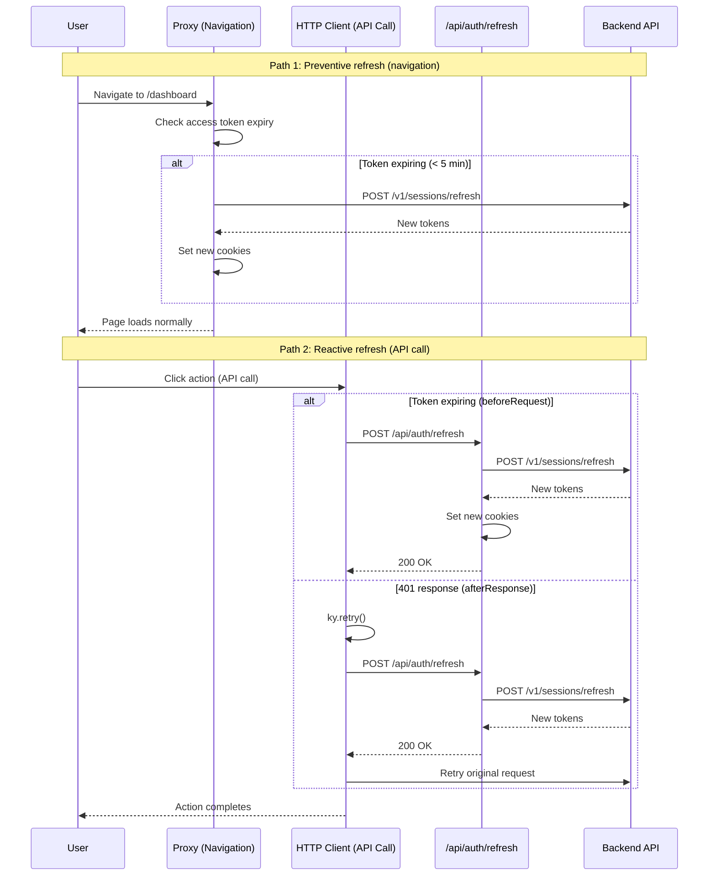

# Auth — Flows

> Per-domain flow catalog. See `_index.md` for format template and conventions.

## Sign in [MVP]

**Trigger:** User navigates to the app without an active session
**Actor:** Any user
**Domain:** Auth

**Happy path:**
1. User opens the app → redirected to sign-in page
2. User fills email and password → clicks "Entrar"
3. System validates credentials → returns JWT tokens
4. User is redirected to dashboard

**Error cases:**
- Invalid credentials → inline error: "Email ou senha incorretos"
- Account locked → toast: "Conta bloqueada. Tente novamente mais tarde."

---

## Sign up [MVP]

> **Status: Post-MVP** — not yet implemented. Admin creates users directly for MVP.

**Trigger:** User clicks "Criar conta" on sign-in page
**Actor:** New user
**Domain:** Auth

**Happy path:**
1. User clicks "Criar conta" → sign-up form opens
2. User fills name, email, password → clicks "Cadastrar"
3. System creates account → returns JWT tokens
4. User is redirected to dashboard

**Error cases:**
- Email already exists → inline error: "Email já cadastrado"
- Weak password → inline validation

---

## Password recovery [MVP]

> **Status: Post-MVP** — not yet implemented. Admin creates users directly for MVP.

**Trigger:** User clicks "Esqueci minha senha" on sign-in page
**Actor:** Existing user
**Domain:** Auth

**Happy path:**
1. User clicks "Esqueci minha senha" → recovery form opens
2. User fills email → clicks "Enviar"
3. System sends recovery link
4. User clicks link → sets new password → redirected to sign-in

**Error cases:**
- Email not found → same success message (security: don't reveal if account exists)

---

## Token refresh [MVP]

**Trigger:** Access token is expired or expiring within 5 minutes
**Actor:** Authenticated user (automatic, transparent)
**Domain:** Auth

**Two refresh points:**

**1. Proxy (preventive — on navigation):**
1. User navigates to any private route
2. Proxy reads access token cookie → decodes JWT → checks if `exp` is within 5 minutes (`REFRESH_THRESHOLD_SECONDS`)
3. If expiring → proxy calls backend `POST /v1/sessions/refresh` with refresh token + CSRF token
4. Backend validates refresh token, revokes old one, generates new access + refresh + CSRF tokens (token rotation)
5. Proxy sets new cookies on the response → user continues without interruption

**2. HTTP client (reactive — on API call):**
1. User performs an action that triggers an API call (e.g., submit form, load data)
2. `beforeRequest` hook checks if access token is expiring → if so, calls `/api/auth/refresh` (client-side only)
3. If token already expired and backend returns 401 → `afterResponse` triggers `ky.retry()` → `beforeRetry` calls `/api/auth/refresh`
4. API route calls backend `POST /v1/sessions/refresh` → updates cookies → retries original request

**Error cases:**
- Refresh token expired (7+ days inactive) → redirect to `/sign-in`
- Refresh token revoked (used twice — replay attack) → redirect to `/sign-in`
- CSRF token missing/invalid → refresh fails → redirect to `/sign-in`

---
