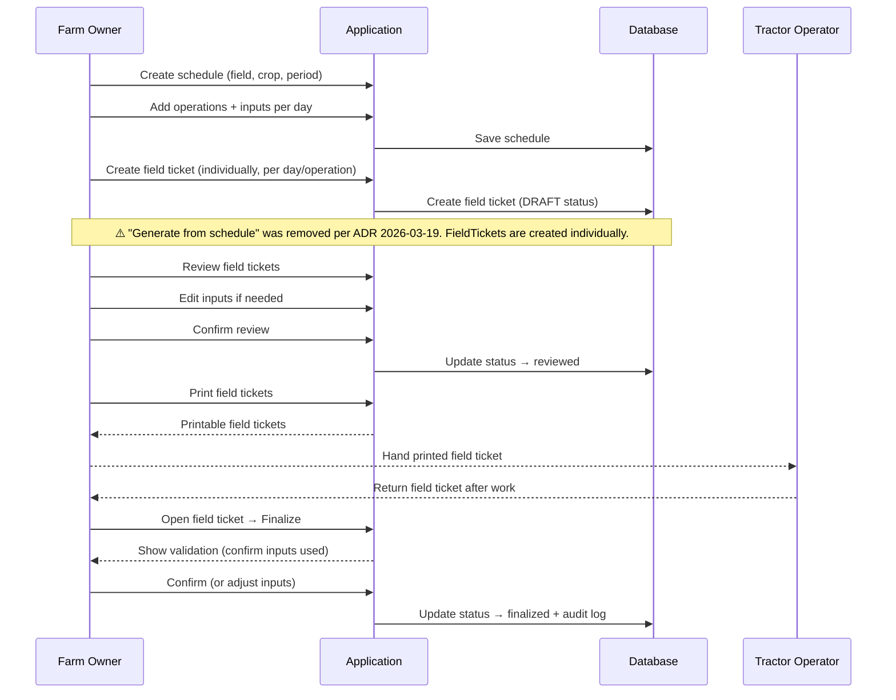

# FieldTicket — Flows

> Per-domain flow catalog. See `_index.md` for format template and conventions.

## Add operation to schedule [MVP]

**Trigger:** User clicks "+" on a day column in the schedule week view
**Actor:** Farm owner, Farm manager
**Domain:** FieldTicket

**Happy path:**
1. User opens schedule detail → week view is displayed with days of harvest period
2. User clicks "+" on a specific day column → create field ticket sheet opens
3. User selects operation type (Pulverização or Fertirrigação) and adds inputs with dosages
4. User submits → system creates a DRAFT field ticket linked to the schedule, field, harvest, and date
5. New operation card appears on that day column

**Error cases:**
- Operation date outside harvest period → error: "Data fora do período da safra"
- Input not found → error: "Insumo não encontrado"
- Invalid dosage → error: "Dosagem inválida"

---

## Review field ticket [MVP]

**Trigger:** User opens a draft field ticket before printing
**Actor:** Farm owner, Farm manager
**Domain:** FieldTicket

**Happy path:**
1. User opens field ticket → sees pre-populated inputs (field, date, operations, products, dosages)
2. User reviews each item → can edit inputs if needed (change product, adjust dosage)
3. **SPRAYING only:** user fills equipment config (vehicle, implement, water volume, bar, turbine, nozzle count, pressure, gear, pH)
4. **FERTIGATION:** vehicle/implement optional; spray config fields are hidden
5. User confirms review → status changes to "reviewed"

**Error cases:**
- Input not available in inventory → warning

---

## Print field ticket [MVP]

**Trigger:** User clicks "Imprimir" on a reviewed field ticket
**Actor:** Farm owner, Farm manager
**Domain:** FieldTicket

**Happy path:**
1. User selects one or more reviewed field tickets → clicks "Imprimir"
2. System groups tickets by type: SPRAYING (6/page, 3×2 grid) and FERTIGATION (8/page, 4×2 grid) on separate pages
3. System generates printable format → browser print dialog opens
4. Status changes to "printed"
5. Printed field ticket is handed to operator (Tratorista for SPRAYING, Irrigante for FERTIGATION)

---

## Finalize field ticket [MVP]

**Trigger:** Operator returns the field ticket after executing the work
**Actor:** Farm owner, Farm manager
**Domain:** FieldTicket

**Happy path:**
1. Operator (Tratorista for SPRAYING, Irrigante for FERTIGATION) returns field ticket after completing work in the field
2. User opens the field ticket in the system → clicks "Finalizar"
3. System shows validation screen: user fills execution data
   - **Both types:** start/end time, operator name (label adapts: "Tratorista" or "Irrigante"), executed dosages per input
   - **SPRAYING only:** hourmeter start/end required
   - **FERTIGATION:** hourmeter fields hidden and not required
4. If last-minute changes happened in the field → user edits the inputs to reflect what was actually used
5. User confirms → status changes to "finalized"
6. Audit log records the finalization with actual inputs used

**Error cases:**
- Inputs differ from original → system asks user to confirm changes
- Finalization can happen same day or next day — no time restriction

---

## Re-evaluate field ticket [MVP]

**Trigger:** User realizes a finalized field ticket was registered incorrectly
**Actor:** Farm owner, Farm manager
**Domain:** FieldTicket

**Happy path:**
1. User opens a finalized field ticket → clicks "Reavaliar"
2. Status changes back to allow editing
3. User corrects the inputs/information
4. User re-finalizes the field ticket
5. Audit log records the re-evaluation with reason and changes

**Error cases:**
- Only users with proper permissions can re-evaluate
